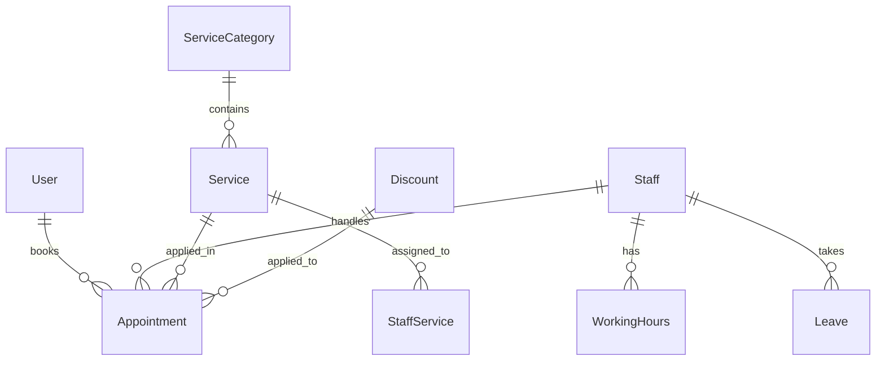
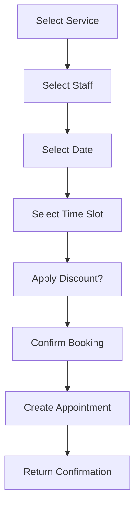

# Salon Management Backend API - Technical Specification

## 1. Project Overview

- **Project Name**: SalonApp API
- **Framework**: ASP.NET Core Web API
- **Database**: Entity Framework Core + MSSQL
- **Authentication**: JWT (JSON Web Tokens)
- **Architecture**: Simple layered architecture (Controllers/Services/Data)

---

## 2. Database Schema

### 2.1 Entity Relationship Diagram



### 2.2 Database Entities

#### User
| Field | Type | Constraints |
|-------|------|-------------|
| Id | int | PK, Identity |
| Email | string | Unique, Required, Max(100) |
| PasswordHash | string | Required |
| FullName | string | Required, Max(100) |
| Phone | string | Required, Max(20) |
| Role | string | Enum: Customer, Staff, Admin |
| CreatedAt | DateTime | Default: UTC Now |
| IsActive | bool | Default: true |

#### ServiceCategory
| Field | Type | Constraints |
|-------|------|-------------|
| Id | int | PK, Identity |
| Name | string | Required, Max(100) |
| Description | string | Max(500) |
| IsActive | bool | Default: true |

#### Service
| Field | Type | Constraints |
|-------|------|-------------|
| Id | int | PK, Identity |
| Name | string | Required, Max(100) |
| Description | string | Max(500) |
| Duration | int | Required (minutes) |
| Price | decimal | Required, >= 0 |
| CategoryId | int | FK → ServiceCategory |
| IsActive | bool | Default: true |
| CreatedAt | DateTime | Default: UTC Now |

#### Staff (extends User)
| Field | Type | Constraints |
|-------|------|-------------|
| Id | int | PK, FK → User |
| Bio | string | Max(500) |
| ProfileImage | string | Max(255) |
| IsAvailable | bool | Default: true |

#### StaffService (Many-to-Many)
| Field | Type | Constraints |
|-------|------|-------------|
| StaffId | int | FK → Staff |
| ServiceId | int | FK → Service |

#### WorkingHours
| Field | Type | Constraints |
|-------|------|-------------|
| Id | int | PK, Identity |
| StaffId | int | FK → Staff |
| DayOfWeek | int | 0-6 (Sunday-Saturday) |
| StartTime | TimeSpan | Required |
| EndTime | TimeSpan | Required |
| IsWorking | bool | Default: true |

#### Leave
| Field | Type | Constraints |
|-------|------|-------------|
| Id | int | PK, Identity |
| StaffId | int | FK → Staff |
| StartDate | DateTime | Required |
| EndDate | DateTime | Required |
| Reason | string | Max(500) |
| Status | string | Enum: Pending, Approved, Rejected |
| CreatedAt | DateTime | Default: UTC Now |

#### Appointment
| Field | Type | Constraints |
|-------|------|-------------|
| Id | int | PK, Identity |
| CustomerId | int | FK → User |
| StaffId | int | FK → Staff |
| ServiceId | int | FK → Service |
| AppointmentDate | DateTime | Required |
| StartTime | TimeSpan | Required |
| EndTime | TimeSpan | Required |
| Status | string | Enum: Pending, Confirmed, Completed, Cancelled, NoShow |
| Notes | string | Max(500) |
| TotalPrice | decimal | Required |
| DiscountId | int | FK → Discount (nullable) |
| FinalPrice | decimal | Required |
| CreatedAt | DateTime | Default: UTC Now |
| UpdatedAt | DateTime | Nullable |

#### Discount
| Field | Type | Constraints |
|-------|------|-------------|
| Id | int | PK, Identity |
| Code | string | Unique, Required, Max(20) |
| Name | string | Required, Max(100) |
| DiscountType | string | Enum: Percentage, Fixed |
| DiscountValue | decimal | Required |
| MinOrderValue | decimal | Default: 0 |
| ValidFrom | DateTime | Required |
| ValidUntil | DateTime | Required |
| IsActive | bool | Default: true |
| MaxUses | int | Nullable |
| UsedCount | int | Default: 0 |

---

## 3. API Endpoints

### Module 1: Authentication

| Method | Endpoint | Description | Auth |
|--------|----------|-------------|------|
| POST | /api/auth/register | Register new user | Public |
| POST | /api/auth/login | Login and get JWT | Public |
| POST | /api/auth/forgot-password | Request password reset | Public |
| POST | /api/auth/reset-password | Reset password with token | Public |
| GET | /api/auth/me | Get current user info | JWT |

#### User Roles: Customer, Staff, Admin

---

### Module 2: Service Management

| Method | Endpoint | Description | Auth |
|--------|----------|-------------|------|
| GET | /api/services | Get all active services | Public |
| GET | /api/services/{id} | Get service by ID | Public |
| POST | /api/services | Create new service | Admin |
| PUT | /api/services/{id} | Update service | Admin |
| DELETE | /api/services/{id} | Soft delete service | Admin |
| GET | /api/services/categories | Get all categories | Public |
| POST | /api/services/categories | Create category | Admin |

---

### Module 3: Staff Management

| Method | Endpoint | Description | Auth |
|--------|----------|-------------|------|
| GET | /api/staff | Get all staff | Public |
| GET | /api/staff/{id} | Get staff by ID | Public |
| POST | /api/staff | Create staff account | Admin |
| PUT | /api/staff/{id} | Update staff | Admin |
| DELETE | /api/staff/{id} | Deactivate staff | Admin |
| PUT | /api/staff/{id}/services | Assign services to staff | Admin |
| GET | /api/staff/{id}/working-hours | Get staff schedule | Public |
| PUT | /api/staff/{id}/working-hours | Update working hours | Staff/Admin |
| GET | /api/staff/{id}/leave | Get staff leave requests | Staff/Admin |
| POST | /api/staff/{id}/leave | Request leave | Staff |
| PUT | /api/leave/{id}/approve | Approve leave request | Admin |
| PUT | /api/leave/{id}/reject | Reject leave request | Admin |

---

### Module 4: Booking System

| Method | Endpoint | Description | Auth |
|--------|----------|-------------|------|
| GET | /api/booking/available-slots | Get available time slots | Public |
| POST | /api/booking | Create new appointment | Customer |
| GET | /api/booking/my-appointments | Get customer's bookings | Customer |
| GET | /api/booking/staff-appointments | Get staff's appointments | Staff |
| PUT | /api/booking/{id}/confirm | Confirm appointment | Staff/Admin |
| PUT | /api/booking/{id}/complete | Mark as completed | Staff |
| PUT | /api/booking/{id}/cancel | Cancel appointment | Customer/Admin |
| GET | /api/booking/{id} | Get appointment details | All |

---

### Module 5: Admin Dashboard

| Method | Endpoint | Description | Auth |
|--------|----------|-------------|------|
| GET | /api/dashboard/today-appointments | Today's appointments | Admin |
| GET | /api/dashboard/revenue | Revenue stats | Admin |
| GET | /api/dashboard/popular-services | Most booked services | Admin |
| GET | /api/dashboard/staff-performance | Staff performance metrics | Admin |
| GET | /api/dashboard/overview | Dashboard summary | Admin |

---

### Module 6: Discounts

| Method | Endpoint | Description | Auth |
|--------|----------|-------------|------|
| GET | /api/discounts | Get active discounts | Public |
| POST | /api/discounts | Create discount | Admin |
| PUT | /api/discounts/{id} | Update discount | Admin |
| DELETE | /api/discounts/{id} | Deactivate discount | Admin |
| POST | /api/discounts/validate | Validate discount code | Public |

---

## 4. JWT Authentication Configuration

### appsettings.json
```json
{
  "Jwt": {
    "Key": "YourSuperSecretKeyMin32Characters!",
    "Issuer": "SalonApp",
    "Audience": "SalonAppUsers",
    "ExpiryMinutes": 60,
    "RefreshTokenExpiryDays": 7
  }
}
```

### Token Claims
- `sub`: User ID
- `email`: User email
- `role`: User role (Customer/Staff/Admin)
- `jti`: Refresh token ID

### Authorization Policies
```csharp
// Policy: CustomerOrAbove
services.AddAuthorization(options => {
    options.AddPolicy("CustomerOrAbove", policy => 
        policy.RequireRole("Customer", "Staff", "Admin"));
    
    options.AddPolicy("StaffOrAbove", policy => 
        policy.RequireRole("Staff", "Admin"));
    
    options.AddPolicy("AdminOnly", policy => 
        policy.RequireRole("Admin"));
});
```

---

## 5. Business Logic - Booking System

### 5.1 Time Slot Generation

```csharp
// Configuration
int slotDuration = 30; // minutes
TimeSpan workStart = new TimeSpan(9, 0, 0); // 9:00 AM
TimeSpan workEnd = new TimeSpan(18, 0, 0); // 6:00 PM
int bufferTime = 15; // minutes between appointments
```

**Algorithm:**
1. Get staff working hours for selected date
2. Generate slots from start to end time in 30-minute intervals
3. Filter out slots where:
   - Staff is on leave
   - Existing appointment overlaps
   - Buffer time not respected

### 5.2 Double Booking Prevention

```csharp
bool IsSlotAvailable(staffId, date, startTime, serviceDuration)
{
    // Check existing appointments
    var endTime = startTime + serviceDuration;
    
    bool hasConflict = appointments.Any(a => 
        a.Date == date &&
        a.StaffId == staffId &&
        a.Status != "Cancelled" &&
        ((a.StartTime <= startTime && a.EndTime > startTime) ||
         (a.StartTime < endTime && a.EndTime >= endTime) ||
         (a.StartTime >= startTime && a.EndTime <= endTime))
    );
    
    return !hasConflict;
}
```

### 5.3 Cancellation Rules

| Condition | Allow Cancellation |
|-----------|-------------------|
| More than 24 hours before | Yes (full refund) |
| 12-24 hours before | Yes (50% refund) |
| Less than 12 hours before | No |
| Already cancelled | No |
| Already completed | No |

### 5.4 Booking Flow



### 5.5 Appointment Status Flow

```
Pending → Confirmed → Completed
    ↓         ↓
 Cancelled  NoShow
```

---

## 6. Response Models

### Standard API Response
```csharp
public class ApiResponse<T>
{
    public bool Success { get; set; }
    public string Message { get; set; }
    public T Data { get; set; }
    public List<string> Errors { get; set; }
}
```

### Paginated Response
```csharp
public class PagedResponse<T>
{
    public List<T> Items { get; set; }
    public int TotalCount { get; set; }
    public int PageNumber { get; set; }
    public int PageSize { get; set; }
    public int TotalPages => (int)Math.Ceiling(TotalCount / (double)PageSize);
}
```

---

## 7. Error Handling

| Status Code | Usage |
|-------------|-------|
| 200 | Success |
| 201 | Created |
| 400 | Bad Request (validation) |
| 401 | Unauthorized |
| 403 | Forbidden |
| 404 | Not Found |
| 409 | Conflict (double booking) |
| 500 | Server Error |

---

## 8. Project Structure

```
SalonApp/
├── Controllers/
│   ├── AuthController.cs
│   ├── ServicesController.cs
│   ├── StaffController.cs
│   ├── BookingController.cs
│   ├── DashboardController.cs
│   └── DiscountsController.cs
├── Models/
│   ├── DTOs/
│   └── Request/
├── Services/
├── Data/
│   ├── AppDbContext.cs
│   └── Migrations/
└── Program.cs
```

---

## 9. Implementation Priority

1. **Phase 1**: Auth, User management
2. **Phase 2**: Service & Category CRUD
3. **Phase 3**: Staff management, Working hours
4. **Phase 4**: Booking system with slot generation
5. **Phase 5**: Admin dashboard, Reports

---

*End of Specification*
